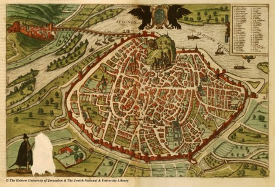

# PROYECTO_3_GEO.

# Objetive
This project aims to determine the perfect location for a new company in the gaming industry among three selected cities. 
​
In order to choose the ideal location, we have been given some requirements and I have prioritized some of them over others (in bold):
- **Designers like to go to design talks and share knowledge. There must be some nearby companies that also do design.**
- 30% of the company staff have at least 1 child.
- Developers like to be near successful tech startups that have raised at least 1 Million dollars.
- **Executives like Starbucks A LOT. Ensure there's a starbucks not too far.**
- **Account managers need to travel a lot.**
- **Everyone in the company is between 25 and 40, give them some place to go party.**
- **The CEO is vegan.**
- If you want to make the maintenance guy happy, a basketball stadium must be around 10 Km.
- The office dog—"Dobby" needs a hairdresser every month. Ensure there's one not too far away.

The above 5 requirements have been selected because:
-  Designers are a key piece within a gaming company.
-  Having an airport nearby is essential if part of team has to travel a lot (in this case: account managers).
-  It is important to keep executives and the CEO happy for the wellbeing of the company and the rest of its employees. 
- Leisure is also a crucial part of everyone lives: happy employees, better performance, higher profits.

​
# Working plan 
​
Firstly, I have chosen 3 cities that I consider they could hypothetically be an appropriate place to set a gaming company:Madrid, Málaga and Barcelona.
​
Then, I have chosen a exact point in those cities. By getting their coordinates, I have made the API Foursquare calls filtering by the requirements above explained: design companies, discos, Starbucks, airports and vegan restaurantas.

Once I have collected all this information for each city, I have import this to Mongo DB Compass where I have created 3 different collections (one for each city). 
​
After that, I have used a Mongo method called [geoNear](https://docs.mongodb.com/manual/reference/operator/aggregation/geoNear/). This have allowed me not only set a maximum radio of distance but also calculating the distances between the coordinates of origin and the information obtained from Foursquare.
​
For the final decision of the location I have normalize these distances per category and weighted them. In the end, a ranking has been obtained on which the final decision was based. 
​
The following resources have been used to achieve the objective of this project: 
​
-  [Foursquare API](https://foursquare.com/): get access to global data and  content from thousands trusted sources. To access all the necessary information about the resources surrounding the possible locations of the enterprise. 
- [MongoDB](https://www.mongodb.com/): is a document database with the scalability and flexibility that we want using querying and indexing.
​
​
### Structure of the project files
​
The structure of this project is composed of:
 1. A folder called "Notebooks" that contains: 

    a) A Jupyter Notebook document called "Foursquare_geoquery_map" where I have made the request to the Foursquare API, evaluated the different location alternatives and weighing the possible solutions in order to get to one final conclusion. In this file, I have also printed a map for each city where information collected from the API can be shown.  

    b) 3 files .json that have been used to import data of each city to 3 different collections in MongoDB Compass.

    
 2. scr folder: folder where a .py file is stored with all the explained functions used during the whole project.  
 3. data: folder where all csv have been kept (final ranking and one for each city).
 
​
# Libraries
​
- [sys](https://docs.python.org/3/library/sys.html)
- [requests](https://pypi.org/project/requests/2.7.0/)
- [pandas](https://pandas.pydata.org/)
- [dotenv](https://pypi.org/project/python-dotenv/)
- [pymongo](https://www.mongodb.com/2)
- [json](https://docs.python.org/3/library/json.html)
- [os](https://docs.python.org/3/library/os.html)
- [reduce](https://docs.python.org/3/library/functools.html)
- [operator](https://docs.python.org/3/library/operator.html)
- [dumps](https://pymongo.readthedocs.io/en/stable/api/bson/json_util.html)
- [MongoClient](https://www.mongodb.com/)
- [GEOSPHERE](https://www.mongodb.com/) 
- [folium](https://pypi.org/project/folium)
- [Marker, Icon, Map](https://matplotlib.org/stable/api/_as_gen/matplotlib.pyplot.plot.html)

